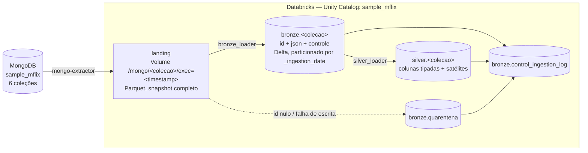

# Arquitetura — sample_mflix (grupo)

Documento de decisões técnicas. A visão geral, o guia de execução e as
justificativas de requisito estão no [README](../README.md).

---

## Fluxo

| Camada | Código | Job | Gatilho |
|---|---|---|---|
| Extract | `notebooks/mongo-extractor.ipynb` | `landing_pipeline` | manual |
| Load (Bronze) | `notebooks/bronze_loader.py` + `bronze_summary.py` | `bronze_pipeline` | cron diário 6h |
| Load (Silver) | `notebooks/silver_loader.py` | `silver_pipeline` | atualização de tabela Bronze |
| Controle | `notebooks/control.py` | — | — |

O ambiente (catálogo, schemas, volume e tabelas) é criado por
`notebooks/setup_ambiente.sql`.

---

## Decisões técnicas

| Item | Decisão | Justificativa |
|---|---|---|
| Formato Bronze e Silver | Delta | padrão do enunciado (R6), ACID, time travel |
| Coluna `id` | extraída do `_id` do Mongo, replicada numa coluna própria (`string`), sem remover `_id` do documento | organização e validação de duplicidade sem alterar o payload (R6 — fidelidade à origem) |
| Idempotência | `MERGE INTO` por `id` (Bronze) e por `id` / `id`+valor nas satélites (Silver) | idempotente por construção (nunca duplica), aceito explicitamente pelo R3 |
| Configuração | `config/pipeline_config.yaml` (global) + `config/collections.json` (por coleção) | R1 exige config externalizada; o JSON serve as três camadas ao mesmo tempo (`exclude_fields` na extração, `load_type`/`watermark_field` na Bronze, `explode_fields` na Silver) |
| Controle de partições | `repartition(ceil(linhas / 200.000))` antes da escrita | R2 — sem isso `users` (185 linhas) virava 8 arquivos Parquet; com isso, 1 arquivo, sem penalizar as coleções grandes |
| Retry | `com_retry()` — 3 tentativas, backoff exponencial de 2s | R2 — cobre falha transitória do storage de objeto, que é a origem de I/O real da Bronze |
| Status da execução | decidido por `reconcile()` da camada de controle | R8 — o limiar (5%) fica num único lugar, e a carga não duplica a regra de qualidade |
| Tratamento de schema (R7) | `mergeSchema` na leitura da landing + quarentena para `id` nulo ou falha de escrita | schema da Bronze é fixo, não evolui — ver abaixo |
| Estrutura da Bronze | **JSON bruto** — `id` + coluna `json` com o documento inteiro, sem nenhum campo achatado | ver "Por que JSON bruto" abaixo |

---

## Por que JSON bruto na Bronze, não colunas tipadas

A Bronze contém só `id` + `json` (documento completo, como está na landing)
+ colunas de controle. Nenhuma divisão do documento em colunas de negócio —
esse achatamento é responsabilidade exclusiva da Silver.

- R7 aceita as duas estratégias (schema explícito **ou** persistência como
  JSON/string bruta). JSON bruto é a opção mais conservadora: a Bronze fica
  fiel à origem, sem nenhuma decisão de shape, e qualquer interpretação
  (`imdb`/`tomatoes` achatados, `explode` de `cast`/`genres`) vira trabalho
  explícito e revisável da camada seguinte.
- O schema da Bronze fica **fixo para sempre** (`id`, `json`, controle).
  Campo novo, campo ausente ou tipo divergente entre documentos não quebram
  a carga nem exigem evolução de schema na escrita.
- Reprocessar Bronze → Silver nunca depende de reconsultar o Mongo: o
  documento original está armazenado e pode ser reinterpretado à vontade.

**Contrapartida:** o custo de tipagem é deslocado para a Silver, que precisa
inferir schema e aplicar `from_json` a cada execução.

### Histórico: decisão original (colunas tipadas), até 2026-08-27

A primeira decisão foi por colunas tipadas na Bronze, com base em: o slide
do professor rotular esse padrão como "Estratégia Bronze"; nenhum código de
exemplo dele gravar Bronze como `id + JSON inteiro`; e ser o comportamento
*default* do Databricks Auto Loader (`_rescued_data` +
`schemaEvolutionMode`). Ambas as opções são válidas e aceitas pelo R7 — a
mudança não corrige um erro, é uma escolha de projeto diferente, tomada para
concentrar toda a modelagem na Silver.

---

## Camada Silver

Uma tabela principal por coleção, com o documento quebrado em colunas
tipadas, mais tabelas satélite para os campos multivalorados.

**Como o schema é obtido:** `schema_of_json_agg` sobre o próprio lote —
nenhuma coluna é declarada à mão, então campo novo na origem aparece
sozinho. Structs aninhados são achatados recursivamente com `_` como
separador (`imdb.rating` → `imdb_rating`, `tomatoes.viewer.rating` →
`tomatoes_viewer_rating`).

**Deduplicação:** `row_number()` particionado por `id` ordenado por
`_ingestion_timestamp` desc — fica só o registro mais recente de cada
documento (*latest record*), como pede o bônus.

**Tabelas satélite:** os campos listados em `explode_fields` saem da tabela
principal e viram `silver.<colecao>_<campo>` com uma linha por par
(`id`, valor). Para `movies`: `cast`, `genres`, `countries`, `directors`,
`writers`.

**Leitura incremental:** a Silver filtra a Bronze por `_ingestion_timestamp`
maior que a watermark da sua última execução bem-sucedida. Coleção sem linha
nova sai com `qtd_lida_origem = 0` e não escreve nada — é assim que o job
processa só as tabelas que mudaram.

**Gatilho:** `trigger.table_update` sobre as 6 tabelas da Bronze, com
`condition: ANY_UPDATED`. O job dispara inteiro quando qualquer uma é
atualizada, e o filtro por watermark faz cada task decidir se tem trabalho.

**Limitação conhecida:** as satélites usam `MERGE` que só insere pares
novos. Se um valor for removido do array na origem (um ator sai do elenco),
a linha antiga permanece na satélite.

---

## Watermark

Watermark é o valor que marca até onde a última execução bem-sucedida já
processou, persistido em `control_ingestion_log.watermark_final`. A execução
seguinte lê esse valor com `get_last_watermark(collection)` e filtra o que
está acima dele.

O campo usado muda por camada:

| Camada | Campo | Observação |
|---|---|---|
| Bronze | campo de negócio (`comments.date`, `movies.lastupdated`) | definido em `collections.json` |
| Silver | `_ingestion_timestamp` da Bronze | chave `silver_<colecao>` no log |

É a forma "manual" de carga incremental, sem CDC real (change streams seriam
o outro bônus). Quem aplica o filtro é sempre a camada de destino, nunca a
extração.

`movies` usa `lastupdated`, que é string. A comparação lexicográfica
funciona porque o formato é fixo (`YYYY-MM-DD HH:MM:SS...`); se variasse,
seria preciso converter antes de comparar.

---

## Limitação conhecida: leitura só do `exec=` mais recente da landing

A Bronze sempre lê apenas a pasta `exec=<timestamp>` mais recente de cada
coleção (`latest_landing_path()`), nunca as intermediárias não consumidas.
É seguro porque cada `exec=` é um **snapshot completo da coleção** (relê
tudo do Mongo, não é delta) — a pasta mais nova é sempre um superconjunto
das anteriores para qualquer documento que ainda exista na fonte. Pular
pastas intermediárias não perde dado novo, mesmo que a Bronze rode com menos
frequência que a extração.

A exceção é um documento **apagado** do Mongo entre duas extrações: ele
nunca chega à Bronze. Aceito conscientemente — tratar isso exigiria
controlar quais pastas já foram consumidas.

**Risco relacionado:** a extração infere schema por amostra
(`sample_size=1000`), então o schema inferido pode variar entre execuções
sem que nada tenha mudado na origem. Não afeta a Bronze (que só serializa o
que chegou), mas afeta a estabilidade das colunas da landing e, por
consequência, da Silver.

---

## Ambientes

O bundle tem dois targets que diferem apenas por variáveis — o código dos
notebooks é idêntico nos dois:

| | `dev` | `prod` |
|---|---|---|
| `table_prefix` | `dev_` | vazio |
| `schedule_pause_status` | `PAUSED` | `UNPAUSED` |

Detalhes de deploy em [jobs/README.md](../jobs/README.md).
