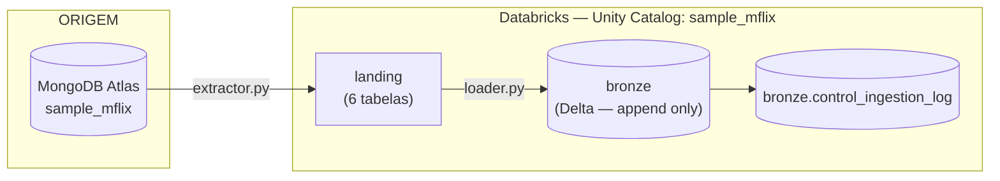

# Arquitetura — sample_mflix (grupo)

> Em construção.

---

## Fluxo

- **Extração:** `notebooks/mongo-extractor.ipynb` — MongoDB → catálogo
  `sample_mflix`, schema `landing` (Parquet versionado por `exec=`).
- **Carga:** `notebooks/bronze_loader.py` — `landing` → schema `bronze`,
  Delta, particionado por `_ingestion_date`. Fechamento em
  `notebooks/bronze_summary.py`.
- **Controle:** `notebooks/control.py` — `bronze.control_ingestion_log`,
  watermark e reconciliação.
- **Orquestração:** `jobs/bronze_pipeline.job.yml` — 7 tasks (6 coleções em
  paralelo + `resumo` com `run_if: ALL_DONE`).

## Decisões técnicas

Preenchido incrementalmente à medida que avaliamos.

| Item | Decisão | Justificativa |
|---|---|---|
| Formato Bronze | Delta | padrão do enunciado (R6), ACID, time travel |
| Coluna `id` | extraída do `_id` do Mongo, replicada numa coluna própria (`string`), sem remover `_id` do documento | organização e validação de duplicidade sem alterar o payload (R6 — fidelidade à origem) |
| Idempotência | `MERGE INTO` por `id` | idempotente por construção (nunca duplica), aceito explicitamente pelo R3 |
| Configuração | `config/pipeline_config.yaml` (global) + `config/collections.json` (por coleção) | R1 exige config externalizada; o JSON serve extração e carga ao mesmo tempo (`exclude_fields` para uma, `load_type`/`watermark_field` para a outra) |
| Controle de partições | `repartition(ceil(linhas / 200.000))` antes da escrita | R2 — sem isso `users` (185 linhas) virava 8 arquivos Parquet; com isso, 1 arquivo, sem penalizar as coleções grandes |
| Retry | `com_retry()` — 3 tentativas, backoff exponencial de 2s | R2 — cobre falha transitória do storage de objeto, que é a origem de I/O real da Bronze |
| Status da execução | decidido por `reconcile()` da camada de controle | R8 — o limiar (5%) fica num único lugar, e a carga não duplica a regra de qualidade |
| Tratamento de schema (R7) | `mergeSchema` na leitura da landing (protege contra diferença de colunas entre arquivos parquet do mesmo `exec=`) + quarentena pra `id` nulo ou falha de escrita | ver justificativa abaixo — schema da Bronze em si é fixo, não evolui |
| Estrutura da Bronze: colunas tipadas vs. JSON bruto numa coluna | **JSON bruto** — `id` + coluna `json` com o documento inteiro, como veio da landing, sem nenhum campo achatado em coluna de negócio | **Decisão revista em 2026-08-28** (ver abaixo) — substitui a decisão anterior por colunas tipadas |

### Por que JSON bruto, não colunas tipadas (decisão revista em 2026-08-28)

A decisão original (colunas tipadas, ver histórico abaixo) foi revertida:
a Bronze passa a conter só `id` + `json` (documento completo, como está
na landing) + colunas de controle — sem dividir o documento em colunas de
negócio. Esse achatamento fica 100% pra camada Silver.

Motivos:
- A landing agora grava todos os campos como `string` (commit
  `e04b815`), então manter colunas tipadas na Bronze já não preservava
  tipo nenhum do Mongo — só duplicava a divisão de campos sem ganho real
  de fidelidade.
- R7 aceita as duas estratégias (schema explícito OU persistência como
  JSON/string bruta) — JSON bruto é a opção mais conservadora: Bronze
  fica 100% fiel à origem, sem nenhuma decisão de shape, e qualquer
  achatamento (`imdb`/`tomatoes` como struct, `explode` de
  `cast`/`genres`, etc.) vira trabalho explícito da Silver — inclusive
  reforça o bônus de Silver (+4 pts, que é exatamente esse achatamento).
- Efeito colateral positivo: schema da Bronze fica fixo pra sempre (`id`,
  `json`, colunas de controle) — não precisa mais de
  `withSchemaEvolution()` no MERGE nem de quarentena por conflito de
  tipo. A quarentena continua existindo (R7 exige nunca descartar
  silenciosamente), mas agora protege contra `id` nulo (documento sem
  `_id` utilizável) ou falha de escrita, não mais schema drift.

### Histórico: decisão original (colunas tipadas), até 2026-08-27

R7 permite as duas estratégias ("schema evolution explícito" OU
"persistência do documento como JSON/string bruta"). A decisão original
foi por colunas tipadas, com base em: o slide do professor rotular esse
padrão como "Estratégia Bronze"; nenhum código de exemplo do professor
gravar Bronze como `id + JSON inteiro`; e ser o comportamento *default*
do Databricks Auto Loader (`_rescued_data` + `schemaEvolutionMode`).
Essa análise não estava errada — ambas as opções (A: JSON bruto, B:
colunas tipadas) são válidas e aceitas pelo R7. A mudança pra A não
corrige um erro, é uma escolha de projeto diferente, tomada depois que a
landing passou a ser 100% string (ver acima).

### Limitação conhecida: leitura só do `exec=` mais recente da landing

A Bronze sempre lê apenas a pasta `exec=<timestamp>` mais recente de cada
coleção na landing (`latest_landing_path()`), nunca as pastas
intermediárias não consumidas. Isso é seguro na prática porque cada
`exec=` é um **snapshot completo da coleção** (relê tudo do
Mongo a cada execução, não é um delta) — a pasta mais nova é sempre um
superconjunto das anteriores pra qualquer documento que ainda exista na
fonte, então pular pastas intermediárias não perde dado novo, mesmo que a
Bronze rode com menos frequência que a extração.

**Risco identificado:** a landing usa inferência de
schema por amostra (`sample_size=1000` default no `expand()`),
*"o schema inferido pode mudar entre uma execução e outra do mesmo
pipeline, sem que nada na origem tenha mudado."* 
Sugestão:
declarar schema explícito ou aumentar `sample_size` pra cobrir a 
coleção inteira nas coleções pequenas/médias.

### O que é "watermark" neste projeto

Watermark é o valor (de um campo de data/hora do próprio dado, ex.:
`comments.date`) que marca até onde a última execução bem-sucedida já
processou. Fica persistido em `control_ingestion_log.watermark_final`. A
próxima execução lê esse valor (`get_last_watermark(collection)`) e só
processa registros com `campo_watermark > watermark_final` anterior. É a
forma "manual" de fazer carga incremental sem CDC real (change streams —
esse seria o bônus). Ver decisão abaixo: quem aplica esse filtro é a
camada Bronze, não a extração.

## Plano de construção — Bronze (fase 1: `users` + `comments`)

1. Confirmar que `get_last_watermark`/`log_execution` vão
   apontar pra tabela real `sample_mflix.bronze.control_ingestion_log`.
2. Criar os objetos de desenvolvimento no Databricks com prefixo `dev_`
   (schema ou tabelas — decidir nomenclatura exata).
3. Escrever uma função genérica `load_to_bronze(collection, load_type,
   watermark_field, target_table)` que:
   a. Gera `start_time` e pega `_ingestion_id` via `get_ingestion_id()`.
   b. Lê a landing (Parquet) da coleção.
   c. Se `load_type == "incremental"`: busca `get_last_watermark(collection)`;
      se vier valor, filtra `campo_watermark > watermark`; se vier `None`,
      trata como primeira carga (lê tudo).
   d. Conta `qtd_lida_origem`.
   e. Monta `json` (documento completo, sem achatar) + `id` (extraído de
      `_id`, replicado numa coluna própria) + colunas de rastreabilidade
      (R4).
   f. Escreve na Bronze via `MERGE INTO` por `id` (idempotência — evita
      duplicar em reprocessamento, e é uma das estratégias explicitamente
      aceitas pelo enunciado nas R3, junto com partição sobrescrita).
   g. Conta `qtd_gravada_destino`, calcula `watermark_final` (maior valor
      do campo de watermark no lote).
   h. Chama `log_execution(...)` — sempre, sucesso ou falha (com try/except).
4. Testar com `users` (full): rodar 2x seguidas, confirmar que não duplica.
5. Testar com `comments` (incremental), replicando as 3 execuções de
   evidência do `SEND_WORK.md`:
   - Execução 1: primeira carga (watermark `None` → lê tudo, ~50.307 docs).
   - Execução 2: roda de novo sem mudar nada na origem → `qtd_lida_origem = 0`.
   - Execução 3: pedir pra rodar a extração de novo depois de
     inserir comentários novos no Mongo com `date` recente (a landing
     precisa ser atualizada primeiro — a Bronze só enxerga o que está na
     landing, não o Mongo direto).
6. Só depois de 4 e 5 validados: expandir a mesma função pras outras
   coleções (`theaters`, `sessions`, `movies`) como tasks de um job.
7. Recriar os objetos sem prefixo `dev_` como a "execução real" e coletar
   as evidências finais em `docs/evidencias/`.

Checklists de apoio: [CHECKLIST_REQUISITOS.md](CHECKLIST_REQUISITOS.md) e
[CHECKLIST_BOAS_PRATICAS_BRONZE.md](CHECKLIST_BOAS_PRATICAS_BRONZE.md).
