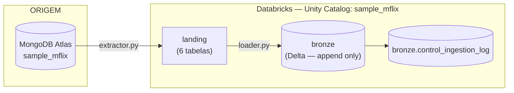

# Arquitetura — sample_mflix (grupo)

> Em construção.

---

## Fluxo

- **Extração (Amanda):** `extractor.py` — MongoDB Atlas → catálogo `sample_mflix`,
  schema `landing`.
- **Carga (Arthur):** `loader.py` — `landing` → schema `bronze`, Delta,
  particionado por `_ingestion_date`.
- **Controle (Carina):** `control.py` — `bronze.control_ingestion_log`.

## Decisões técnicas

Preenchido incrementalmente à medida que avaliamos.

| Item | Decisão | Justificativa |
|---|---|---|
| Formato Bronze | Delta | padrão do enunciado (R6), ACID, time travel |
| Coluna `id` | extraída do `_id` do Mongo, separada do documento | organização e validação de duplicidade sem alterar o payload (R6 — fidelidade à origem) |
| Idempotência | `MERGE INTO` por `id` | idempotente por construção (nunca duplica), aceito explicitamente pelo R3 |
| Schema drift | `mergeSchema` na leitura + `withSchemaEvolution()` no MERGE + tabela de quarentena pra incompatibilidade real de tipo | R7, ver justificativa completa abaixo |
| Estrutura da Bronze: colunas tipadas (structs/arrays preservando o documento) vs. JSON bruto numa coluna | **Colunas tipadas**, preservando nomes e aninhamento do documento original (`imdb`/`tomatoes`/`awards` continuam struct, `genres`/`cast` continuam array) — nada achatado pra colunas de negócio soltas | Ver "Por que colunas tipadas, não JSON bruto" abaixo |

### Por que colunas tipadas, não JSON bruto (`id` + documento inteiro numa coluna)

R7 permite as duas estratégias ("schema evolution explícito" OU "persistência do
documento como JSON/string bruta"):

- **Schema explícito:** declara um
  `StructType` explícito preservando a estrutura do documento (`imdb`
  continua struct aninhado, `genres`/`cast` continuam array) e o
  resultado é `df_bronze`. Texto do slide: *"Estratégia Bronze: campos
  problemáticos entram como `string` e a conversão vira uma regra
  explícita no Silver."* Ou seja, o próprio professor rotula esse padrão
  (colunas tipadas, preservando estrutura, sem achatar pra negócio) como
  "Estratégia Bronze".
- **Código real (não só slide) — conferido em `mongo_reader.py`,
  `mongo_reader_.py`, `Exercicios.py`, `code-samples/*.ipynb`:** em
  **nenhum** desses arquivos ele grava uma tabela Bronze como `id +
  coluna única com o JSON inteiro`. O `MongoReader.read(infer=False)`
  até devolve `_id, body` (JSON bruto), mas isso nunca é escrito como
  tabela — só aparece em `.display()` pra exploração, é uma etapa
  intermediária da classe. Todo write real (Postgres, API, Mongo via
  `expand()`) materializa colunas tipadas.

**Decisão:** manter a Bronze com colunas tipadas herdadas da landing
(nada renomeado, nada descartado, nada achatado pra colunas de negócio
soltas — struct/array preservam a estrutura original do documento).
Reforça essa escolha o desafio bônus de Silver (+4 pts) ser exatamente
"achatamento de `imdb`/`tomatoes`, explode de `cast`/`genres`" — se a
Bronze já fizesse isso, esse bônus perderia sentido.

### Comparação com o mercado (não só o material da disciplina)

Existem três variações reais pra Bronze de fonte semiestruturada, não duas:

| Opção | Descrição | Avaliação |
|---|---|---|
| **A — JSON bruto** | `id` + coluna única com o documento inteiro (string ou tipo `VARIANT` do Delta) | Válida e conservadora — reprocessa Bronze→Silver sem depender de reconsultar a fonte. Hoje, com `VARIANT`, dá pra ter isso e ainda consultar campo a campo sem `from_json` explícito. |
| **B — Colunas tipadas + schema evolution + rescue** (nossa escolha) | Schema aplicado (explícito ou inferido), mas com `mergeSchema`/`withSchemaEvolution()` pra absorver campo novo e quarentena pro que não bate | É o comportamento *default* do Databricks Auto Loader pra fonte semiestruturada (`_rescued_data` + `schemaEvolutionMode`) — não é simplificação de sala de aula, é padrão real da ferramenta. |
| **C — Achatar campos de negócio** | Explodir `cast`, achatar `imdb.rating` em coluna solta já na Bronze | **Não é** best practice em lugar nenhum — acopla Bronze a decisão de negócio que pertence à Silver. Descartada. |

**Decisão final:** mantivemos B. É best practice real, já implementada 
e validada com dado real, e o enunciado (R7)
aceita tanto A quanto B como estratégias válidas — trocar pra A agora
seria refazer trabalho testado por um ganho de "pureza arquitetural" que
o trabalho não exige. A (JSON bruto/`VARIANT`) seria a escolha por
padrão numa arquitetura nova sem restrição de tempo, mas não é superior o
suficiente pra justificar o retrabalho aqui.

### Limitação conhecida: leitura só do `exec=` mais recente da landing

A Bronze sempre lê apenas a pasta `exec=<timestamp>` mais recente de cada
coleção na landing (`latest_landing_path()`), nunca as pastas
intermediárias não consumidas. Isso é seguro na prática porque cada
`exec=` é um **snapshot completo da coleção** (relê tudo do
Mongo a cada execução, não é um delta) — a pasta mais nova é sempre um
superconjunto das anteriores pra qualquer documento que ainda exista na
fonte, então pular pastas intermediárias não perde dado novo, mesmo que a
Bronze rode com menos frequência que a extração.

**Risco identificado:** a landing usa inferência de
schema por amostra (`sample_size=1000` default no `expand()`),
*"o schema inferido pode mudar entre uma execução e outra do mesmo
pipeline, sem que nada na origem tenha mudado."* 
Sugestão:
declarar schema explícito ou aumentar `sample_size` pra cobrir a 
coleção inteira nas coleções pequenas/médias.

### O que é "watermark" neste projeto

Watermark é o valor (de um campo de data/hora do próprio dado, ex.:
`comments.date`) que marca até onde a última execução bem-sucedida já
processou. Fica persistido em `control_ingestion_log.watermark_final`. A
próxima execução lê esse valor (`get_last_watermark(collection)`) e só
processa registros com `campo_watermark > watermark_final` anterior. É a
forma "manual" de fazer carga incremental sem CDC real (change streams —
esse seria o bônus). Ver decisão abaixo: quem aplica esse filtro é a
camada Bronze, não a extração.

## Plano de construção — Bronze (fase 1: `users` + `comments`)

1. Confirmar que `get_last_watermark`/`log_execution` vão
   apontar pra tabela real `sample_mflix.bronze.control_ingestion_log`.
2. Criar os objetos de desenvolvimento no Databricks com prefixo `dev_`
   (schema ou tabelas — decidir nomenclatura exata).
3. Escrever uma função genérica `load_to_bronze(collection, load_type,
   watermark_field, target_table)` que:
   a. Gera `start_time` e pega `_ingestion_id` via `get_ingestion_id()`.
   b. Lê a landing (Parquet) da coleção.
   c. Se `load_type == "incremental"`: busca `get_last_watermark(collection)`;
      se vier valor, filtra `campo_watermark > watermark`; se vier `None`,
      trata como primeira carga (lê tudo).
   d. Conta `qtd_lida_origem`.
   e. Adiciona colunas de rastreabilidade (R4) + `id` (extraído de `_id`,
      separado do resto do documento).
   f. Escreve na Bronze via `MERGE INTO` por `id` (idempotência — evita
      duplicar em reprocessamento, e é uma das estratégias explicitamente
      aceitas pelo enunciado nas R3, junto com partição sobrescrita).
   g. Conta `qtd_gravada_destino`, calcula `watermark_final` (maior valor
      do campo de watermark no lote).
   h. Chama `log_execution(...)` — sempre, sucesso ou falha (com try/except).
4. Testar com `users` (full): rodar 2x seguidas, confirmar que não duplica.
5. Testar com `comments` (incremental), replicando as 3 execuções de
   evidência do `SEND_WORK.md`:
   - Execução 1: primeira carga (watermark `None` → lê tudo, ~50.307 docs).
   - Execução 2: roda de novo sem mudar nada na origem → `qtd_lida_origem = 0`.
   - Execução 3: pedir pra rodar a extração de novo depois de
     inserir comentários novos no Mongo com `date` recente (a landing
     precisa ser atualizada primeiro — a Bronze só enxerga o que está na
     landing, não o Mongo direto).
6. Só depois de 4 e 5 validados: expandir a mesma função pras outras
   coleções (`theaters`, `sessions`, `movies`) como tasks de um job.
7. Recriar os objetos sem prefixo `dev_` como a "execução real" e coletar
   as evidências finais em `docs/evidencias/`.

Checklists de apoio: [CHECKLIST_REQUISITOS.md](CHECKLIST_REQUISITOS.md) e
[CHECKLIST_BOAS_PRATICAS_BRONZE.md](CHECKLIST_BOAS_PRATICAS_BRONZE.md).
